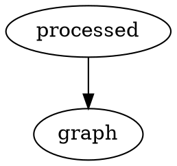
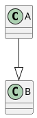

# Plugin examples

## Admonish

```admonish info
info,todo
```

```admonish note
note
```

```admonish tldr
tldr,summary,abstract
```

```admonish tip
tip,hint,important
```

```admonish success
success,check,done
```

```admonish question
question,help,faq
```

```admonish warning
warning,caution,attention
```

```admonish failure
failure,fail,missing
```

```admonish danger
danger,errror
```

```admonish bug
bug
```

```admonish example
example
```

```admonish quote
quote,cite
```

## Graphviz



## Mermaid


## Plant UML

